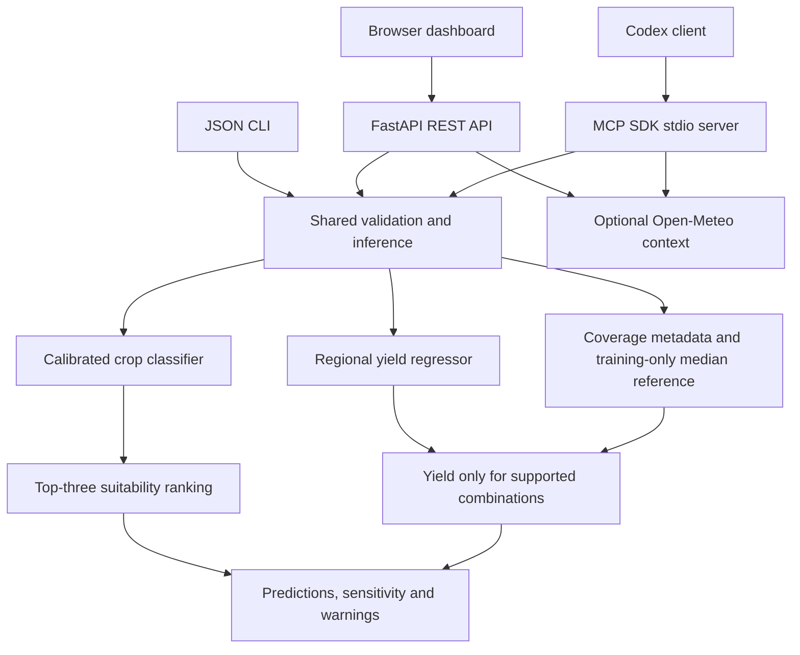

# AgroIntel architecture

The two datasets are modeled independently; they do not represent paired farm observations. Yield never reorders crop suitability. A missing crop mapping or unsupported historical location returns a null yield with a reason, not an invented estimate. Current weather is fetched only on request and never silently changes prediction inputs.

Offline operation needs Python dependencies and the bundled trusted model files; no raw datasets, internet or API key is needed for prediction. The model pipelines include their imputers/encoders. Hash verification precedes deserialization. This detects accidental corruption, not malicious artifacts with edited metadata: never load untrusted joblib files.

## Reproducibility

Random seed 42. Classifier: 1,760 training records, 440 untouched test records, three-fold selection and training-only calibration comparison. Regressor: pre-2009 selection training, 2009–2010 validation, then 1998–2010 final training and 2011–2012 testing (2,275 records). Test records are not used to calculate local explanation medians. Source files, units, exclusions and hashes are recorded under data/provenance.

## Local explanations

For a crop, replace one feature with its training median and recompute that crop's probability. Delta = original probability minus replacement probability. All seven probes are computed in one batch. Yield probes replace only year/area, keeping categorical context fixed. These deltas are neither causal nor additive; implausible feature combinations remain a limitation. No claim of SHAP attribution is made.

## Security and deployment boundaries

Web defaults to loopback; container port mapping also defaults to loopback. JSON-only bounded prediction bodies, strict schemas, host checks, same-origin checks, and a restrictive content-security policy are included. Inputs are never evaluated as code or written into HTML. API keys and user data are not persisted. The app is a single-user academic demo without authentication, per-user quotas or TLS: do not expose it publicly without adding these controls. MCP uses stdio and has no public network listener. Coordinates leave the machine only when the weather tool is invoked.
